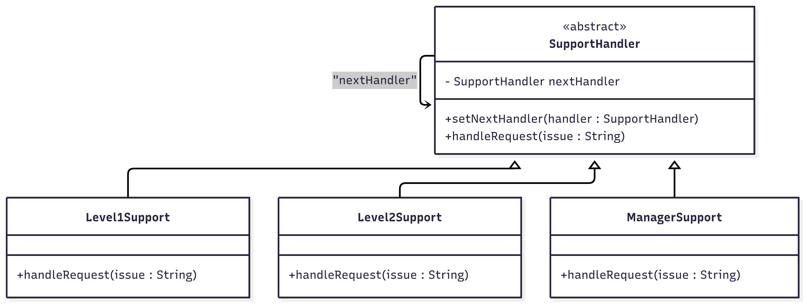

# Chain of Responsibility Pattern – Support System

## Overview
The **Chain of Responsibility** allows multiple objects to handle a request by passing it along a dynamic chain until one (or more) handles it. 
Requests are passed along a chain of handlers (support levels) until one of them handles the request.

## Class Diagram


## Components
- **Handler (SupportHandler)**  
	Defines the interface for handling requests and for setting the next handler in the chain.

- **Concrete Handlers**  
	- `Level1Support`: Handles basic issues (password resets, account access).  
	- `Level2Support`: Handles intermediate technical issues (software/configuration).  
	- `ManagerSupport`: Handles escalated or policy-level requests.

- **Client (SupportSystem)**  
	Assembles the handler chain and accepts user input (issue descriptions/levels).

## How It Works
1. `SupportSystem` creates handler instances and links them into a chain (Level1 -> Level2 -> Manager).  
2. A request is submitted to the first handler in the chain.  
3. Each handler checks whether it can process the request; if not, it forwards the request to the next handler.

## Benefits
- Clean separation of responsibility across handler levels.  
- New handlers can be inserted without modifying existing ones.  
- Supports dynamic composition of handler chains (runtime configurability).

## Usage
1. Compile and run (PowerShell example):
	 ```powershell
	 javac src\*.java
	 java  SupportSystem
	 ```
2. Follow the prompts to submit requests and see which handler processes them.

## Example
- Submit a low-level request like "password reset" — handled by `Level1Support`.  
- Submit a technical request — forwarded to `Level2Support`.  
- Submit an escalated/policy request — handled by `ManagerSupport`.

