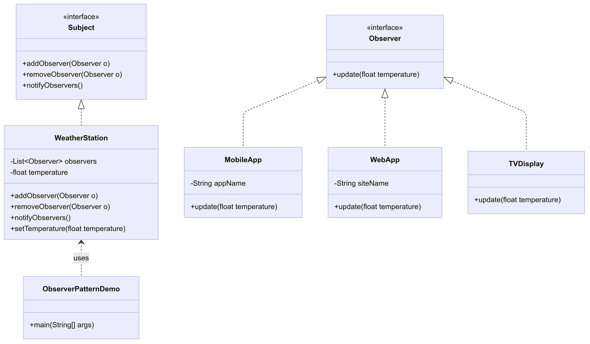

# Observer Pattern – Weather Station

## Overview
This project demonstrates the **Observer Design Pattern** in Java using a Weather Station system.  
The Observer Pattern defines a one-to-many dependency between objects so that when one object (subject) changes state, all its dependents (observers) are automatically notified.

# Class Diagram



## Components
- **Subject (WeatherStation)**  
  Maintains a list of observers and notifies them when the temperature changes.

- **Observers**  
  - **MobileApp**: Updates mobile applications with the latest weather data.  
  - **WebApp**: Updates websites with new temperature values.  
  - **TVDisplay**: Updates TV channels with weather information.  

- **Client (ObserverPatternDemo)**  
  Allows the user to input new temperature values, triggering updates to all observers.

## How It Works
1. Observers subscribe to the WeatherStation.  
2. When the temperature changes, the WeatherStation notifies all observers.  
3. Each observer updates itself independently.  

## Benefits
- **Loose Coupling**: Observers and subjects are independent.  
- **Scalability**: Easy to add new observers without modifying existing code.  
- **Real-World Relevance**: Weather updates are a common real-life use case.  

## Usage
1. Compile and run the program.  
   ```bash
   javac src/*.java
   cd src
   java ObserverPatternDemo
2. Enter temperature values (e.g., `25.5`).  
3. Observe that all registered observers receive and display updates.  
4. Type `exit` to quit.  

