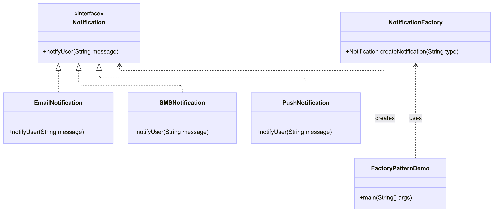

# Factory Pattern – Notification System

## Overview
This project demonstrates the **Factory Design Pattern** in Java using a Notification System.  
The Factory Pattern is a creational design pattern that provides an interface for creating objects in a superclass,  
but allows subclasses (or specific types) to alter the type of objects that will be created.
# Class Diagram



## Components
- **Product Interface (Notification)**  
  Defines a common method `notifyUser()` for all notification types.

- **Concrete Products**  
  - **EmailNotification**: Sends notifications via email.  
  - **SMSNotification**: Sends notifications via SMS.  
  - **PushNotification**: Sends notifications via push services.  

- **Factory (NotificationFactory)**  
  Responsible for creating notification objects based on input type.  

- **Client (FactoryPatternDemo)**  
  Uses the factory to get the appropriate notification object and send a message.

## How It Works
1. The user selects a notification type (Email/SMS/Push).  
2. The `NotificationFactory` creates the appropriate notification object.  
3. The client calls `notifyUser()` on the created object, sending the message.  

## Benefits
- **Follows SOLID Principles**:  
  - Open/Closed: New notification types can be added without modifying existing code.  
  - Single Responsibility: Each class has a single purpose.  
- **Flexibility**: Easy to extend with new notification types.  
- **Decoupling**: Client code is not directly dependent on concrete classes.  

## Usage
1. Compile and run the program.
   ```bash
   javac src/*.java
   cd src
   java FactoryPatternDemo  
2. Enter a notification type (`email`, `sms`, `push`) and a message.  
3. Observe the notification being sent via the chosen channel.  

