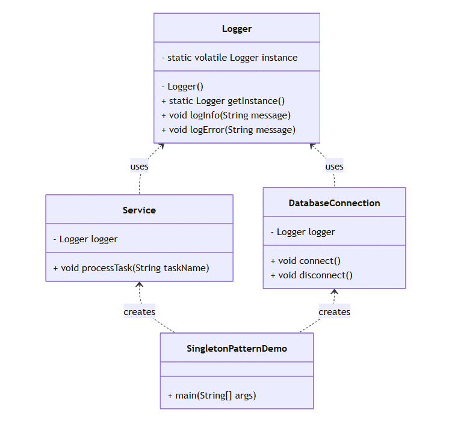

# Singleton Pattern – Logger System

## Overview
This project demonstrates the implementation of the **Singleton design pattern** in Java.  
The Singleton pattern ensures that a class has only **one instance** and provides a global point of access to it.  
Here, a `Logger` class is implemented as a singleton so that all parts of the application share the same logging instance.
# Class Diagram



## Components 

* **Singleton (Logger)**
  - Provides a single, globally accessible instance for logging.
  - Thread-safe implementation using **double-checked locking**.
  - Offers methods for logging info and error messages.

* **Client Classes**
  - **Service**: Simulates business operations and logs task execution.
  - **DatabaseConnection**: Demonstrates logging for database activities.
  - **SingletonPatternDemo**: Main program that coordinates the workflow.

## How It Works
1. The `Logger` class has a **private constructor** to prevent direct instantiation.
2. The `getInstance()` method ensures only one instance is created, even in multi-threaded environments.
3. Client classes (`Service`, `DatabaseConnection`) call `Logger.getInstance()` to obtain the same logger and log messages.

## Usage
1. **Compilation and Execution**:
   ```bash
   javac src/*.java
   cd src
   java SingletonPatternDemo
