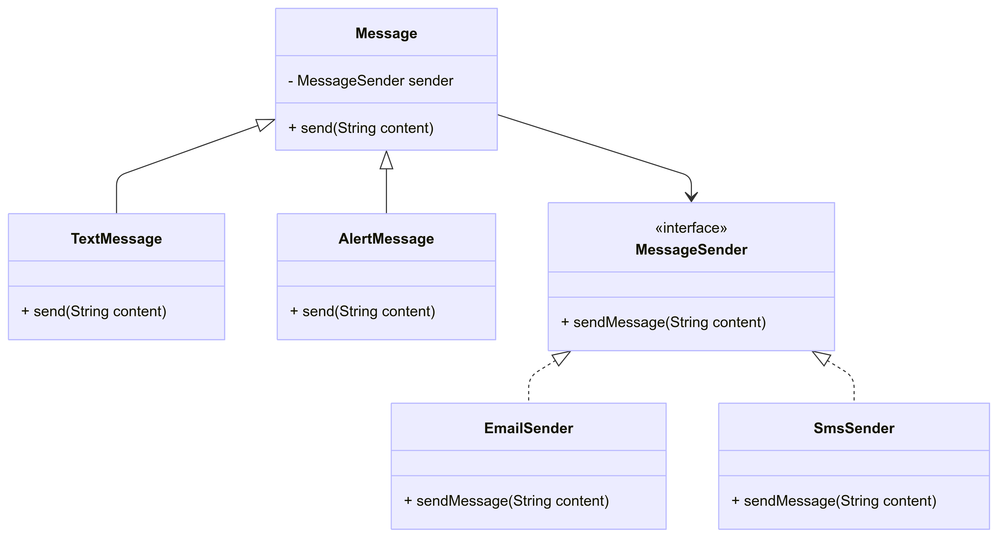

# Bridge Pattern – Message Sending System

## Overview
The **Bridge Pattern** is a structural design pattern that decouples an abstraction from its implementation so the two can vary independently. It does this by splitting a concept into two separate class hierarchies — an abstraction hierarchy and an implementation hierarchy — and connecting them with a reference (the “bridge”).
 

# Class Diagram



## Components
- **Abstraction (Message)**  
	Defines a high-level interface `send(String content)` for message types.

- **Refined Abstractions**  
	- `TextMessage`: Simple textual messages.  
	- `AlertMessage`: Messages flagged as alerts.

- **Implementor (MessageSender)**  
	Interface for sending messages via different channels.

- **Concrete Implementors**  
	- `EmailSender`: Sends messages via email.  
	- `SmsSender`: Sends messages via SMS.

- **Client (BridgePatternDemo)**  
	Interactive CLI that composes messages with a sender and sends them.

## How It Works
1. The user selects a message type (Text/Alert).  
2. The user selects a sender (Email/SMS).  
3. The client creates a `Message` instance with the chosen `MessageSender` and calls `send(content)`.

## Benefits
- **Separation of Concerns**: Abstractions and implementations evolve independently.  
- **Extensibility**: Add new message types or senders without changing existing code.  
- **Decoupling**: Client code composes behavior rather than depending on concrete classes.

## Usage
1. Compile and run the program.
	 ```powershell
	 javac src\*.java
	 java BridgePatternDemo
	 ```
2. Follow the interactive prompts: choose message type, sender, and enter message content.
3. Observe the output showing the message sent via the chosen channel.

## Example
- Send a Text message via Email: choose `1`, `email`, enter: "Meeting at 10 AM".  
- Send an Alert via SMS: choose `2`, `sms`, enter: "Server is down!"


