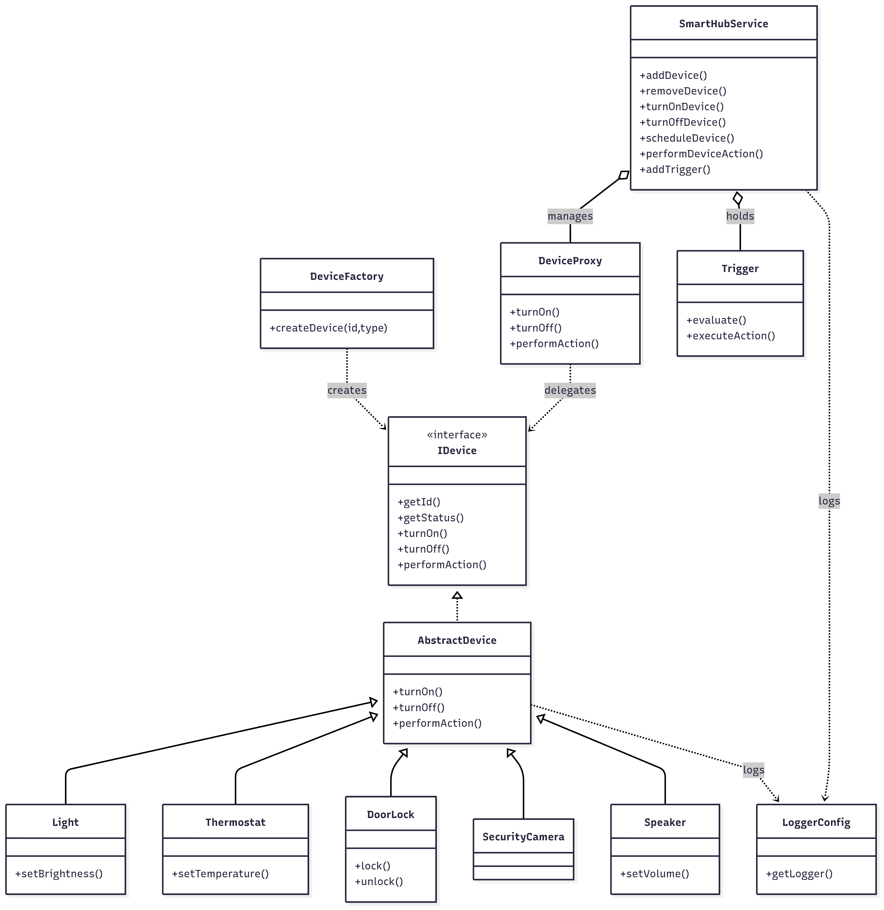

# Smart Home Application

This project is a small command-line based Smart Hub that manages devices (lights, thermostats, door locks, cameras, speakers). It demonstrates common OOP patterns: factory, proxy, observer, triggers, and scheduler.

# Class Diagram



## Features

- Device abstraction via `IDevice` and `AbstractDevice`.
- Concrete device types: `Light`, `Thermostat`, `DoorLock`, `SecurityCamera`, `Speaker`.
- `DeviceFactory` to create devices by type.
- `DeviceProxy` enforces simple access control before delegating to real devices.
- `SmartHubService` manages devices, observers, scheduled actions, and triggers.
- `Trigger` allows condition+action automation evaluated periodically by the hub.
- Centralized logging via `LoggerConfig`.

## Project structure (key files)

- `com.smarthome.Main` — CLI entry point.
- `com.smarthome.service.SmartHubService` — hub/service that manages devices and triggers.
- `com.smarthome.factory.DeviceFactory` — factory for creating devices.
- `com.smarthome.proxy.DeviceProxy` — proxy wrapper for access control.
- `com.smarthome.model.*` — device models and interfaces:
  - `IDevice`, `AbstractDevice`, `Light`, `Thermostat`, `DoorLock`, `SecurityCamera`, `Speaker`.
- `com.smarthome.trigger.Trigger` — encapsulates condition and action.
- `com.smarthome.util.LoggerConfig` — logging configuration.
- `com.smarthome.exception.DeviceOperationException` — device operation errors.

## Design notes

- The application demonstrates:
  - Inheritance and polymorphism: `AbstractDevice` provides a common implementation; concrete devices extend and override as needed.
  - Interfaces for contracts: `IDevice`, `Observer`, `Subject`.
  - Factory pattern: `DeviceFactory` centralizes device creation.
  - Proxy pattern: `DeviceProxy` wraps devices for access checks.
  - Observer pattern: `SmartHubService` acts as `Subject` and registers devices (observers).
  - Trigger pattern: `Trigger` objects hold a `Predicate` and `Consumer` evaluated by the hub scheduler.

## Run (Windows quick)

From the repository root in Command Prompt or PowerShell you can run the following commands to compile and run the app:

```powershell

dir /S /B src\*.java > sources.txt


javac @sources.txt -d out


java -cp out com.smarthome.Main
```

Notes:
- `out` will be created by `javac` as the target directory; remove it when you want a clean rebuild.
